# Network Security Basics — Assessment Report

**Cyber Security Internship — Redynox**
**Intern:** Daniel Theodore Akinkeji
**Tools Used:** [Wireshark v4.6.6](https://www.wireshark.org/) | Windows Defender Firewall
**Network Environment:** Home Wi-Fi (Eni_OBA_nfE) | Qualcomm FastConnect 6900 | Windows 11

---

## Overview

This project documents the completion of Task 1 of the Redynox Cyber Security Internship — Introduction to Network Security Basics. The objective was to understand fundamental network security concepts by:

- Researching and summarising common network threats
- Implementing basic security measures on a home network
- Capturing and analysing live network traffic using Wireshark
- Reflecting on security best practices and how to educate others

---

## Summary of Security Measures Implemented

| Security Measure | Details | Status |
|---|---|---|
| Firewall Configuration | Windows Defender Firewall | ✅ Enabled on all profiles |
| Custom Firewall Rule | Block Telnet (Port 23 TCP) | ✅ Implemented |
| Network Encryption | WPA3-Personal + AES | ✅ Confirmed active |
| Default Password Policy | Router admin password changed | ✅ Verified |
| Traffic Monitoring | Wireshark (Wi-Fi interface) | ✅ Captured & analysed |
| Traffic Types Identified | DNS, HTTP, HTTPS/TLS, TCP | ✅ Documented |

---

## 1. Network Threats Researched

### 🦠 Viruses
A computer virus is malicious code that attaches itself to legitimate programs or files and replicates when executed. Viruses can corrupt or delete files, slow down system performance, and spread to other connected devices on the same network. They typically require user action (such as opening an infected file) to activate.

### 🪱 Worms
Unlike viruses, worms are self-replicating malware that spread across networks without requiring user interaction. They exploit vulnerabilities in operating systems or applications to move from device to device, consuming bandwidth and degrading network performance. The famous WannaCry ransomware spread as a worm across unpatched Windows systems.

### 🐴 Trojans
Trojans disguise themselves as legitimate software but carry hidden malicious functionality. Once installed, they can create backdoors for attackers, steal sensitive data, log keystrokes, or give attackers remote control of the infected machine. Unlike viruses and worms, Trojans rely on social engineering rather than self-replication.

### 🎣 Phishing Attacks
Phishing is a social engineering attack where attackers impersonate trusted entities (banks, employers, popular services) via email, SMS, or fake websites to trick users into revealing sensitive information such as passwords or credit card numbers. Spear phishing targets specific individuals with highly personalised messages, making them harder to detect.

---

## 2. Security Measures Implemented

### 2.1 Windows Defender Firewall

Windows Defender Firewall was verified to be active on both Private and Public (Guest) network profiles, blocking all incoming connections to applications not explicitly on the allowed list.

**Why this matters:** A properly configured firewall prevents malicious actors from establishing unsolicited connections to your device, blocking intrusion attempts, malware command-and-control callbacks, and port scanning activity.

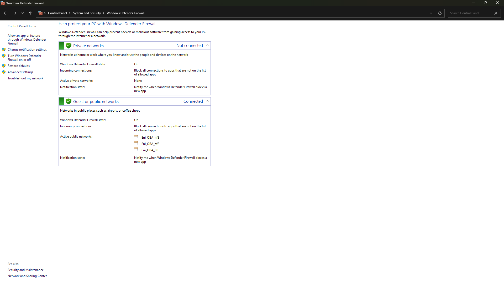
*Windows Defender Firewall active on both Private and Public (Guest) network profiles*

---

### 2.2 Custom Firewall Rule — Blocking Telnet (Port 23)

A custom Inbound Rule was created in Windows Defender Firewall Advanced Settings to block all TCP connections on Port 23 (Telnet), applied across Domain, Private, and Public profiles.

**Why Telnet was blocked:** Telnet transmits all data — including usernames and passwords — in plain text without any encryption. Any attacker monitoring the network (e.g. using Wireshark) can intercept Telnet credentials in real time. Blocking this port eliminates the risk of accidental or malicious Telnet usage.

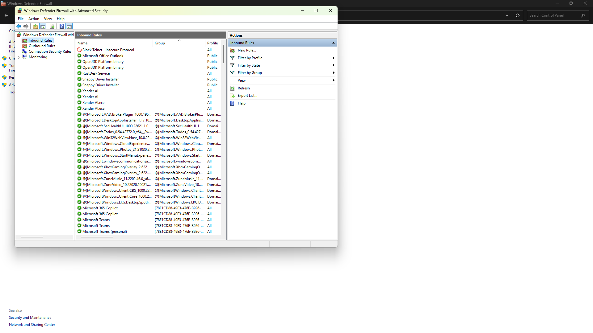
*Inbound Rules list showing 'Block Telnet — Insecure Protocol' rule at the top*

---

### 2.3 Network Encryption — WPA3-Personal + AES

The active Wi-Fi network was confirmed to be using **WPA3-Personal** security with **AES** (Advanced Encryption Standard) encryption, verified through Windows Network Connections → Wireless Network Properties → Security tab.

**Why WPA3 matters:** WPA3 is the latest and most secure Wi-Fi standard. It provides stronger encryption, protects against brute-force attacks using Simultaneous Authentication of Equals (SAE), and ensures forward secrecy — meaning past traffic cannot be decrypted even if a password is later compromised.

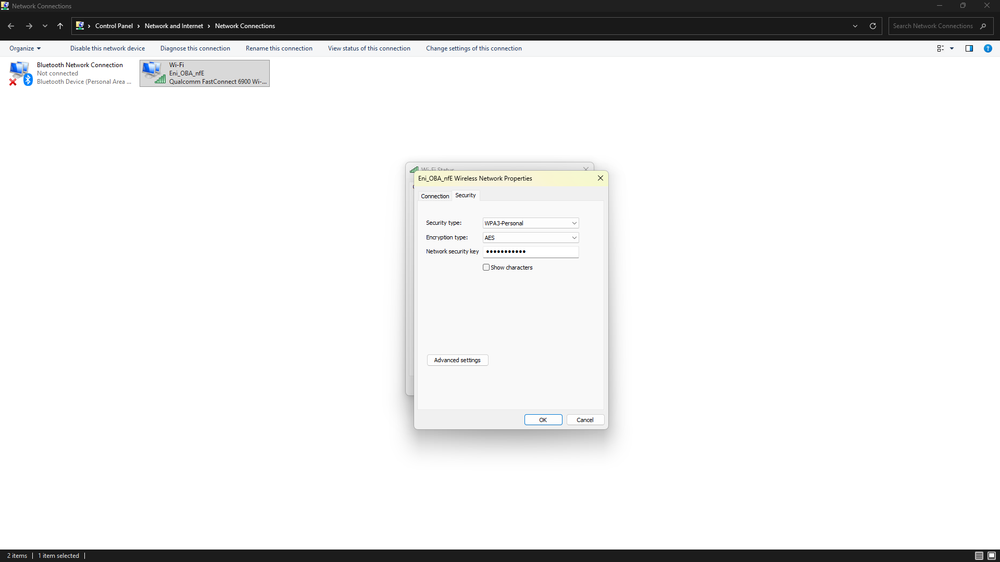
*Wireless Network Properties showing WPA3-Personal security type and AES encryption*

---

### 2.4 Default Password Change

The default administrator password on the home network router was verified to have been changed from the factory-set default. Router manufacturers typically ship devices with well-known default credentials (often `admin/admin`) that are publicly documented and easily exploited.

**Why this matters:** Attackers routinely scan networks for devices still using default credentials. Once inside a router, an attacker can redirect DNS traffic, intercept communications, or use the device as a launch point for further attacks.

---

## 3. Network Traffic Capture and Analysis

Wireshark v4.6.6 was installed and used to capture live network traffic on the Wi-Fi interface.

### Wireshark Setup

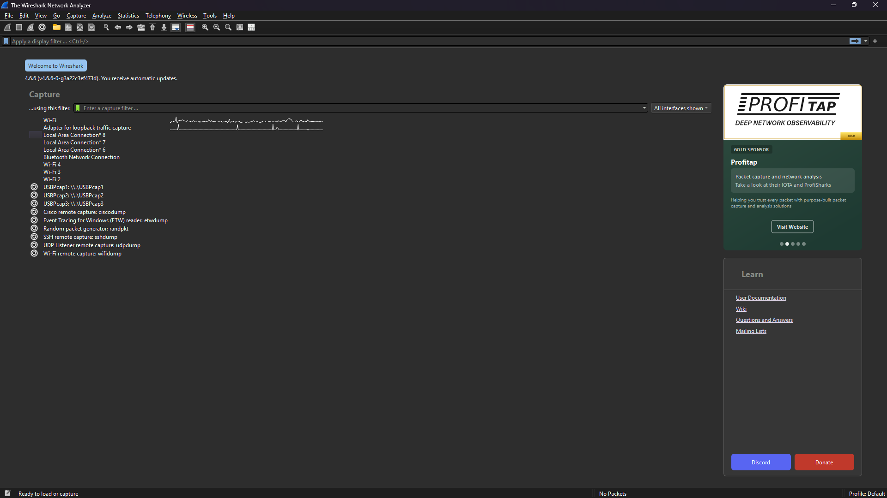
*Wireshark welcome screen showing all available network interfaces including the active Wi-Fi adapter*

---

### 3.1 Live Traffic Capture

A live capture on the Wi-Fi interface recorded thousands of packets within seconds, demonstrating the constant background activity of a modern networked device — a mix of DNS, TCP, TLS, and QUIC traffic.

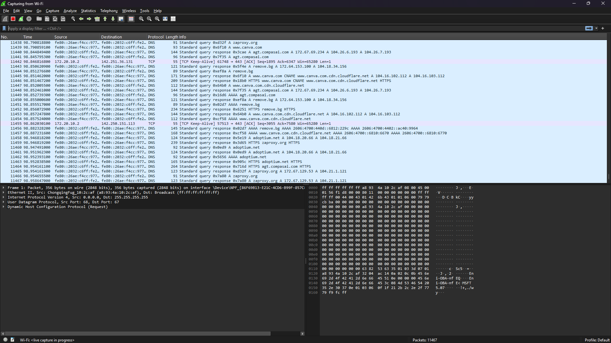
*Live capture in progress — DNS queries visible alongside TCP and QUIC traffic*

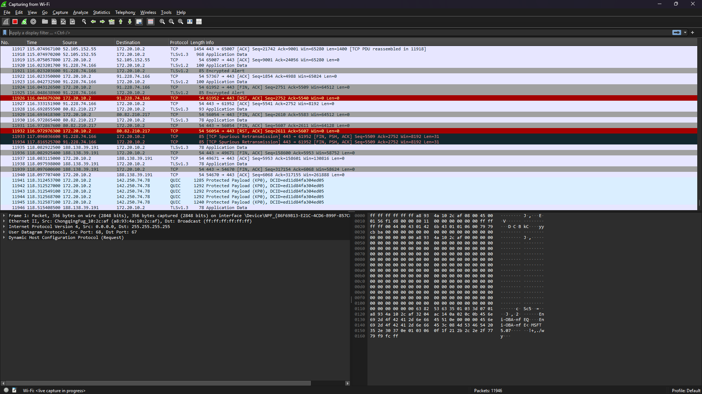
*Continued capture showing mixed traffic with highlighted red/black packets indicating retransmissions*

---

### 3.2 DNS Traffic

**Filter used:** `dns`

DNS (Domain Name System) is the internet's 'phone book' — every connection to a website starts with a DNS query to resolve the domain name into an IP address. The capture showed standard DNS queries and responses for domains including `youtube.com`, `google.com`, `canva.com`, and `zaproxy.org`.

**Security relevance:** DNS traffic is often unencrypted and can be manipulated by attackers in DNS spoofing or DNS poisoning attacks, redirecting users to malicious websites.

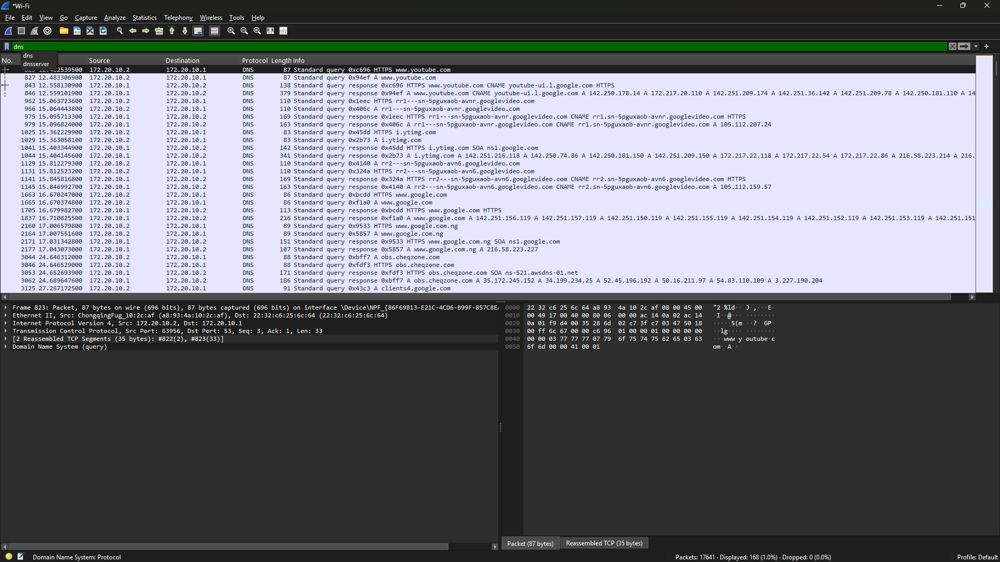
*DNS filter applied — standard queries and responses for youtube.com, google.com, and other domains*

---

### 3.3 TCP Traffic

**Filter used:** `tcp`

TCP (Transmission Control Protocol) is the foundational transport protocol used by most internet applications. The capture showed connection establishment (SYN/SYN-ACK handshakes), data transfer, and connection termination. Highlighted red packets represent TCP retransmissions — normal occurrences indicating brief packet loss.

**Security relevance:** TCP traffic analysis helps identify port scanning, unusual connection patterns, or unexpected data transfers that could indicate data exfiltration.

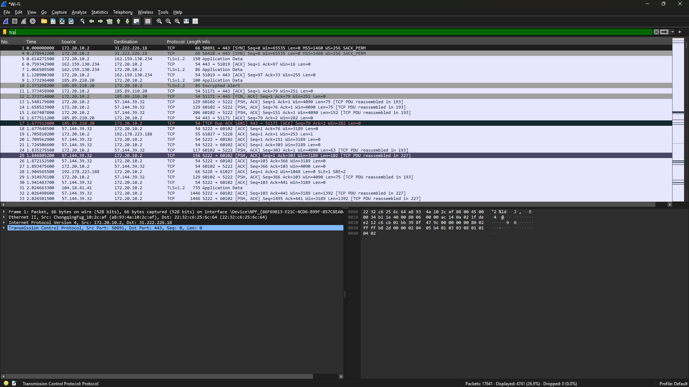
*TCP filter applied — showing handshakes, data transfers, and highlighted retransmission packets*

---

### 3.4 HTTP Traffic (Plain Text)

**Filter used:** `http`

When the HTTP filter was applied during normal browsing, **no results appeared** — because all modern websites use HTTPS rather than plain HTTP. To generate observable plain HTTP traffic, the site [http://neverssl.com](http://neverssl.com) was visited, a site specifically designed to use unencrypted HTTP for testing purposes.

The capture clearly showed GET requests and HTTP 200 OK responses in plain text, confirming that unencrypted HTTP exposes all transmitted data to anyone monitoring the network.

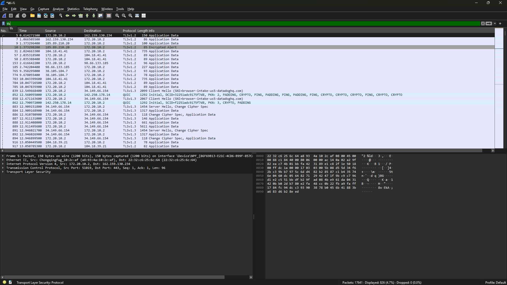
*HTTP filter during normal browsing — no results, demonstrating that modern sites use HTTPS by default*

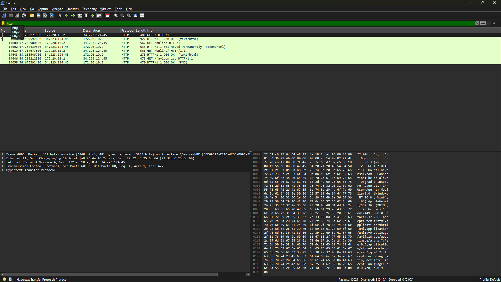
*HTTP filter after visiting neverssl.com — GET requests and 200 OK responses visible in plain text*

---

### 3.5 HTTPS / TLS Traffic

**Filter used:** `tls`

TLS (Transport Layer Security) traffic represented the majority of web traffic captured. The capture showed TLS 1.2 and 1.3 handshakes (Client Hello, Server Hello, Change Cipher Spec), followed by encrypted Application Data packets — unreadable without the encryption keys, unlike plain HTTP above.

**Security relevance:** The prevalence of TLS traffic confirms that most modern communication is encrypted by default — a significant baseline security improvement over older unencrypted protocols.

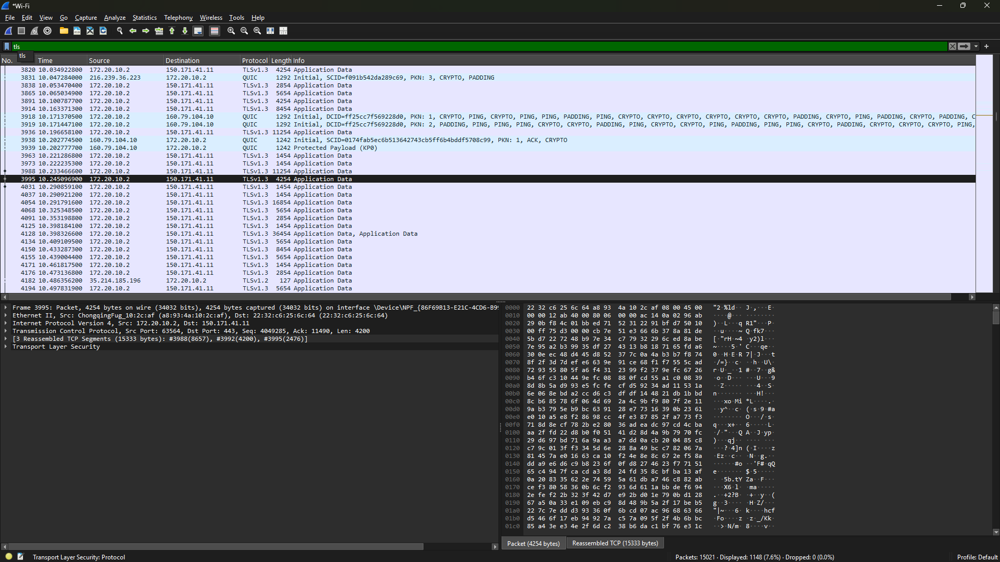
*TLS filter applied — showing TLS 1.2/1.3 encrypted Application Data and handshake messages*

---

## 4. How These Measures Protect the Network

Together, the security measures implemented create a **layered defence (defence-in-depth)**:

- 🔥 **Firewall** — blocks unsolicited inbound connections, preventing attackers from reaching services on the device
- 🚫 **Telnet block** — eliminates plain-text credential exposure, particularly dangerous on shared or public Wi-Fi
- 🔐 **WPA3 + AES** — ensures wireless data is unreadable to anyone intercepting the signal without the decryption key
- 🔑 **Default password change** — closes one of the most commonly exploited entry points in home networks
- 👁️ **Wireshark monitoring** — provides network visibility, enabling detection of unusual patterns or suspicious protocols

---

## 5. Educating Others About Network Security

Network security is often seen as a complex technical subject — but most breaches exploit simple, preventable mistakes. If educating others, I would start with the highest-impact basics: always change the default password on any new router or connected device; ensure your Wi-Fi uses WPA3 (or minimum WPA2) encryption and never leave a network open; be cautious of any website beginning with `http://` rather than `https://`, as the former transmits data in plain text readable by anyone on the same network. I would use a live Wireshark demonstration to show just how much information is visible on an unencrypted network — because seeing raw data in a packet capture is far more persuasive than any explanation. The goal is to make people understand that cybersecurity is not just a technical responsibility but a daily habit, as natural as locking a front door.

---

## Tools Used

| Tool | Version | Purpose |
|---|---|---|
| Wireshark | v4.6.6 | Network traffic capture and analysis |
| Windows Defender Firewall | Windows 11 built-in | Firewall configuration and rule management |
| Network Connections (ncpa.cpl) | Windows 11 built-in | Wi-Fi security verification |

---

## References

- [Wireshark Official Documentation](https://www.wireshark.org/docs/)
- [Microsoft Windows Defender Firewall Guide](https://docs.microsoft.com/en-us/windows/security/threat-protection/windows-firewall/)
- [OWASP Network Security Cheat Sheet](https://cheatsheetseries.owasp.org/cheatsheets/Network_Security_Cheat_Sheet.html)
- [WPA3 Security Overview — Wi-Fi Alliance](https://www.wi-fi.org/discover-wi-fi/security)
- [NIST Cybersecurity Framework](https://www.nist.gov/cyberframework)

---

*This assessment was performed on a personal home network as part of a cybersecurity internship. No third-party systems were tested or accessed.*
